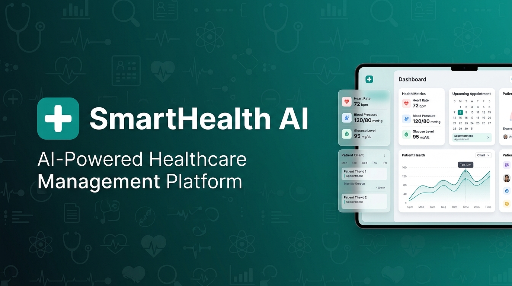
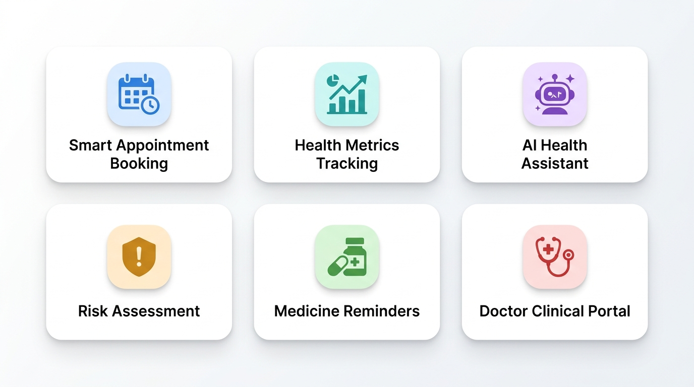
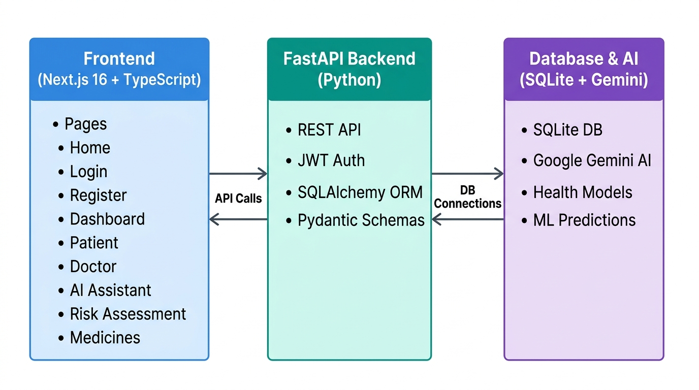

<div align="center">



# ➕ SmartHealth AI
### AI-Powered Healthcare Management Platform

[](https://nextjs.org/)
[](https://fastapi.tiangolo.com/)
[](https://python.org/)
[](https://www.typescriptlang.org/)
[](https://tailwindcss.com/)
[](https://sqlite.org/)
[](https://ai.google.dev/)
[](./LICENSE)

**Monitor health metrics · Book appointments · Track medications · Get AI health insights**

[🚀 Live Demo](#) · [📖 API Docs](#api-documentation) · [🐛 Report Bug](../../issues) · [✨ Request Feature](../../issues)

</div>

---

## 📋 Table of Contents

- [Overview](#-overview)
- [Features](#-features)
- [Architecture](#-architecture)
- [Tech Stack](#-tech-stack)
- [Project Structure](#-project-structure)
- [Getting Started](#-getting-started)
  - [Prerequisites](#prerequisites)
  - [Installation](#installation)
  - [Running the App](#running-the-app)
- [API Documentation](#-api-documentation)
- [User Roles](#-user-roles)
- [Environment Variables](#-environment-variables)
- [Contributing](#-contributing)
- [License](#-license)

---

## 🌟 Overview

**SmartHealth AI** is a full-stack, production-ready healthcare management platform that empowers patients and doctors with AI-driven insights, real-time health monitoring, and seamless appointment management — all in one unified platform.

> ⚕️ *Disclaimer: This platform is intended for informational and educational purposes only and does not constitute medical advice.*

---

## ✨ Features



| Feature | Description |
|---|---|
| 📅 **Smart Appointment Booking** | Book consultations with specialist doctors in seconds with real-time status tracking |
| 📊 **Health Metrics Tracking** | Monitor heart rate, blood pressure, glucose, and sleep from one unified dashboard |
| 🤖 **AI Health Assistant** | 24/7 AI assistant powered by Google Gemini for instant health Q&A |
| ⚠️ **Risk Assessment** | AI-powered health risk scoring that flags potential health concerns early |
| 💊 **Medicine Reminders** | Track daily medications and mark doses as taken with a single click |
| 🩺 **Doctor Clinical Portal** | Doctors manage patient queues, confirm appointments, and track daily schedules |
| 🔐 **JWT Authentication** | Secure token-based auth with role-based access control (Patient / Doctor) |
| 📱 **Responsive Design** | Fully responsive UI optimized for desktop, tablet, and mobile |

---

## 🏗️ Architecture



The application follows a clean **client-server architecture** with a decoupled frontend and backend:

```
smart-healthcare/
├── Frontend (Next.js 16 + TypeScript)   ←→   Backend (FastAPI + Python)   ←→   Database (SQLite)
│    Port: 3000                               Port: 8000                           smart_healthcare.db
```

**Request Flow:**
1. User interacts with the **Next.js** frontend
2. Frontend makes **REST API calls** to the FastAPI backend
3. Backend validates requests using **JWT tokens** and **Pydantic schemas**
4. **SQLAlchemy ORM** queries/writes to the SQLite database
5. AI features are powered by **Google Gemini API**

---

## 🛠️ Tech Stack

### Frontend
| Technology | Version | Purpose |
|---|---|---|
| [Next.js](https://nextjs.org/) | 16.3.0 | React framework with SSR & routing |
| [React](https://react.dev/) | 19.2.8 | UI component library |
| [TypeScript](https://www.typescriptlang.org/) | 5.x | Type-safe JavaScript |
| [Tailwind CSS](https://tailwindcss.com/) | 4.x | Utility-first CSS framework |

### Backend
| Technology | Version | Purpose |
|---|---|---|
| [FastAPI](https://fastapi.tiangolo.com/) | 0.141.1 | High-performance REST API framework |
| [SQLAlchemy](https://www.sqlalchemy.org/) | 2.0.51 | Python ORM for database operations |
| [Pydantic](https://docs.pydantic.dev/) | 2.12.5 | Data validation & settings management |
| [Uvicorn](https://www.uvicorn.org/) | 0.52.1 | ASGI web server |
| [Python-Jose](https://python-jose.readthedocs.io/) | 3.5.0 | JWT token handling |
| [Bcrypt](https://pypi.org/project/bcrypt/) | 5.0.0 | Password hashing |
| [Passlib](https://passlib.readthedocs.io/) | 1.7.4 | Password management |

### AI & Data
| Technology | Purpose |
|---|---|
| [Google Gemini AI](https://ai.google.dev/) | AI health assistant & insights |
| [Scikit-learn](https://scikit-learn.org/) | ML-based health risk predictions |
| [Pandas & NumPy](https://pandas.pydata.org/) | Data processing & analytics |
| [SQLite](https://sqlite.org/) | Lightweight embedded database |

---

## 📁 Project Structure

```
smart-healthcare/
│
├── 📂 backend/                   # FastAPI Python Backend
│   └── app/
│       ├── api/
│       │   ├── auth.py           # Authentication routes (login, register)
│       │   ├── appointments.py   # Appointment CRUD endpoints
│       │   ├── health_metrics.py # Health metrics tracking endpoints
│       │   └── medicines.py      # Medicine reminder endpoints
│       ├── database/
│       │   └── database.py       # SQLAlchemy engine & session setup
│       ├── models/               # SQLAlchemy ORM models
│       ├── schemas/              # Pydantic request/response schemas
│       ├── services/             # Business logic layer
│       └── main.py               # FastAPI app entry point & CORS
│
├── 📂 frontend/                  # Next.js TypeScript Frontend
│   └── src/app/
│       ├── page.tsx              # Landing / Home page
│       ├── layout.tsx            # Root layout
│       ├── login/                # Login page
│       ├── register/             # Registration page
│       └── dashboard/
│           ├── layout.tsx        # Dashboard shell (sidebar + nav)
│           ├── patient/          # Patient dashboard
│           ├── doctor/           # Doctor clinical portal
│           ├── ai-assistant/     # AI health chatbot
│           ├── risk-assessment/  # Risk scoring page
│           ├── medicines/        # Medicine tracker
│           ├── book-appointment/ # Appointment booking
│           └── team/             # Team/about page
│
├── 📂 docs/images/               # README assets & screenshots
├── requirements.txt              # Python dependencies
├── run_project.bat               # One-click launcher (Windows)
├── run_backend.bat               # Start backend only
└── run_frontend.bat              # Start frontend only
```

---

## 🚀 Getting Started

### Prerequisites

Make sure you have the following installed:

- **Python** 3.11+ → [Download](https://python.org/downloads/)
- **Node.js** 18+ → [Download](https://nodejs.org/)
- **npm** 9+ (comes with Node.js)
- **Git** → [Download](https://git-scm.com/)

### Installation

**1. Clone the repository**

```bash
git clone https://github.com/your-username/smart-healthcare.git
cd smart-healthcare
```

**2. Set up the Backend**

```bash
# Create and activate a virtual environment
python -m venv backend/venv

# Windows
backend\venv\Scripts\activate

# macOS/Linux
source backend/venv/bin/activate

# Install Python dependencies
pip install -r requirements.txt
```

**3. Configure Backend Environment**

```bash
# Copy the example file
cp backend/.env.example backend/.env
```

Edit `backend/.env` with your values:
```env
SECRET_KEY=your-super-secret-jwt-key-here
ALGORITHM=HS256
ACCESS_TOKEN_EXPIRE_MINUTES=30
GEMINI_API_KEY=your-google-gemini-api-key
```

**4. Set up the Frontend**

```bash
cd frontend
npm install
```

Configure `frontend/.env.local`:
```env
NEXT_PUBLIC_API_URL=http://localhost:8000
```

### Running the App

#### Option A — One-Click Launch (Windows) ⚡

Simply double-click **`run_project.bat`** in the project root, or run:

```bat
run_project.bat
```

This starts both the backend and frontend simultaneously.

#### Option B — Manual Start

**Terminal 1 — Start Backend:**
```bash
# From project root, with venv activated
cd backend
uvicorn app.main:app --reload --host 0.0.0.0 --port 8000
```

**Terminal 2 — Start Frontend:**
```bash
cd frontend
npm run dev
```

#### Access the App

| Service | URL |
|---|---|
| 🌐 Frontend (App) | http://localhost:3000 |
| ⚡ Backend API | http://localhost:8000 |
| 📖 API Swagger Docs | http://localhost:8000/docs |
| 📚 API ReDoc | http://localhost:8000/redoc |

---

## 📖 API Documentation

The backend auto-generates interactive API documentation via Swagger UI.

**Base URL:** `http://localhost:8000`

### Endpoints Overview

| Category | Method | Endpoint | Description |
|---|---|---|---|
| **Auth** | `POST` | `/api/auth/register` | Register a new user (patient/doctor) |
| **Auth** | `POST` | `/api/auth/login` | Login & receive JWT token |
| **Auth** | `GET` | `/api/auth/me` | Get current user profile |
| **Appointments** | `GET` | `/api/appointments` | List all appointments |
| **Appointments** | `POST` | `/api/appointments` | Book a new appointment |
| **Appointments** | `PUT` | `/api/appointments/{id}` | Update appointment status |
| **Appointments** | `DELETE` | `/api/appointments/{id}` | Cancel appointment |
| **Health Metrics** | `GET` | `/api/health-metrics` | Retrieve logged health data |
| **Health Metrics** | `POST` | `/api/health-metrics` | Log new health measurement |
| **Health Metrics** | `GET` | `/api/health-metrics/risk` | Get AI risk assessment score |
| **Medicines** | `GET` | `/api/medicines` | List all medicine reminders |
| **Medicines** | `POST` | `/api/medicines` | Add a new medicine reminder |
| **Medicines** | `PUT` | `/api/medicines/{id}` | Mark medicine as taken |
| **Medicines** | `DELETE` | `/api/medicines/{id}` | Delete a medicine |

> 🔐 All endpoints (except `/register` and `/login`) require a **Bearer token** in the `Authorization` header.

---

## 👥 User Roles

SmartHealth AI supports **two distinct user roles:**

### 🧑‍⚕️ Patient
- View & update personal health metrics (heart rate, BP, glucose, sleep)
- Book appointments with doctors
- Track daily medications & mark doses taken
- Chat with the AI health assistant
- View AI-generated health risk assessment
- Access personal health history & trends

### 👨‍⚕️ Doctor
- View patient appointment queue
- Confirm, complete, or cancel appointments
- Access the clinical management portal
- View daily patient schedule

---

## 🔐 Environment Variables

### Backend (`backend/.env`)

| Variable | Required | Default | Description |
|---|---|---|---|
| `SECRET_KEY` | ✅ | — | JWT signing secret key |
| `ALGORITHM` | ✅ | `HS256` | JWT algorithm |
| `ACCESS_TOKEN_EXPIRE_MINUTES` | ✅ | `30` | Token expiry in minutes |
| `GEMINI_API_KEY` | ✅ | — | Google Gemini AI API key |

### Frontend (`frontend/.env.local`)

| Variable | Required | Default | Description |
|---|---|---|---|
| `NEXT_PUBLIC_API_URL` | ✅ | `http://localhost:8000` | Backend API base URL |

> 🔑 Get a free Gemini API key at [Google AI Studio](https://aistudio.google.com/app/apikey)

---

## 📊 Project Stats

<div align="center">

| Metric | Value |
|---|---|
| 🔌 API Endpoints | 15+ |
| 📄 App Pages | 8+ |
| 👤 User Roles | 2 (Patient & Doctor) |
| 🧠 Health Models | 4 |
| 🐍 Python Packages | 50+ |
| ⚛️ React Version | 19.x |

</div>

---

## 🤝 Contributing

Contributions are welcome! Here is how to get started:

1. **Fork** the repository
2. Create a feature branch: `git checkout -b feature/amazing-feature`
3. **Commit** your changes: `git commit -m "Add amazing feature"`
4. **Push** to the branch: `git push origin feature/amazing-feature`
5. Open a **Pull Request**

Please make sure your code follows the existing style conventions and includes appropriate tests.

---

## 📜 License

This project is licensed under the **MIT License** — see the [LICENSE](./LICENSE) file for details.

---

## 🙏 Acknowledgements

- [FastAPI](https://fastapi.tiangolo.com/) — for the incredible Python web framework
- [Next.js](https://nextjs.org/) — for the production-grade React framework
- [Google Gemini](https://ai.google.dev/) — for powering the AI health assistant
- [Tailwind CSS](https://tailwindcss.com/) — for the beautiful utility-first styling
- [SQLAlchemy](https://www.sqlalchemy.org/) — for robust ORM capabilities

---

<div align="center">

**Made with ❤️ for better healthcare**

⭐ Star this repo if you found it helpful!

[](../../stargazers)
[](../../network/members)

</div>
